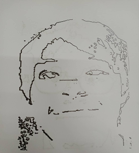

# Teleoperation of Portrait Drawing with Robot Arm

This project is a part of the undergraduate course FRA503-IOT with concept command robot drawings from everywhere.

**Code Description of Image Preprocessing Step**

1. Image Upload Website: Located in Nodejs/main.js, this file serves as the server to render the HTML UI for clients.

2. Image Preprocessing: Located in Nodejs/image_processing.py, this file contains face recognition functionality, generates portrait images from the pre-trained CycleGAN model, and performs line extraction.

3. Train CycleGAN: Located in CycleGAN_Tutorial.ipynb, I followed the architecture outlined in this tutorial: [DigitalSreeni CycleGAN Tutorial](https://www.youtube.com/watch?v=VzIO5_R9XEM&ab_channel=DigitalSreeni).

4. Robot Arm Control: Located in Nodejs/run_ur.py, this file receives points extracted from image_processing.py, converts them to the robotics frame, and sets the robot's position.

**Reference Paper**

Nasrat, S.; Kang, T.; Park, J.; Kim, J.; Yi, S.-J. Artistic Robotic Arm: Drawing Portraits on Physical Canvas under 80 Seconds. Sensors 2023, 23, 5589. https://doi.org/10.3390/s23125589

